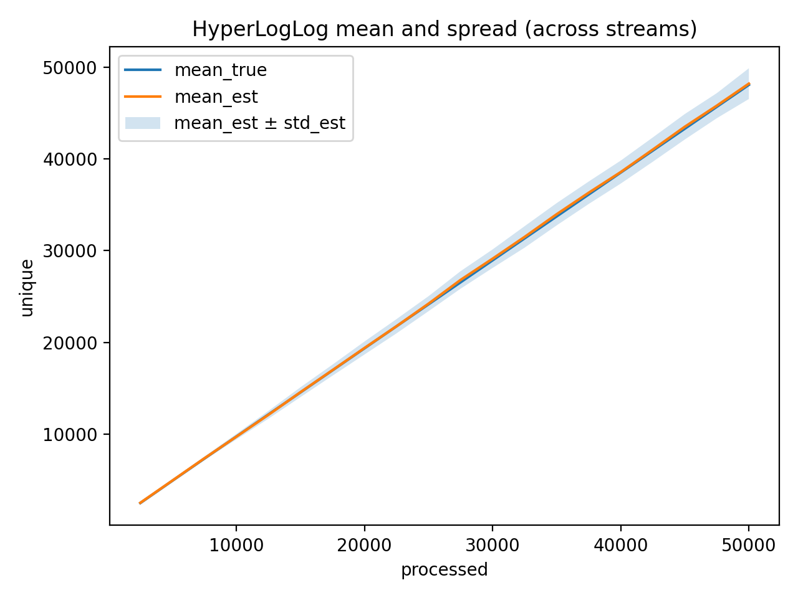

# A3. HyperLogLog (В файлах есть pdf с этим заданием)

## Этап 1. Создание инфраструктуры

- `RandomStreamGen` — генерация строк до 30 символов (буквы, цифры, дефис)
- `HashFuncGen` — хеш-функция FNV-1a + SplitMix64, $h : U \to 2^{64}$

## Этап 2. Реализация и оценка точности

Параметр $B = 10$ → $m = 1024$ регистра. Теоретическая ошибка: $\sigma \approx \frac{1.04}{\sqrt{1024}} \approx 3.25\%$

**Эксперимент:** $N = 50\,000$, 30 потоков, 20 контрольных точек.

### График №1: Сравнение $N_t$ и $F_t^0$

### График №2: Статистики оценки

## Этап 3. Анализ результатов

| Обработано | $F_t^0$ | $\mathbb{E}(N_t)$ | $\sigma_N$ | Отн. ошибка |
|------------|---------|-------------------|------------|-------------|
| 2 500 | 2 463 | 2 491 | 93 | 3.73% |
| 25 000 | 24 153 | 24 222 | 819 | 3.38% |
| 50 000 | 48 092 | 48 228 | 1 676 | 3.48% |

**Вывод:** ошибка ~3.5% укладывается в теоретические рамки $\frac{1.04}{\sqrt{m}} \approx 3.25\%$ и $\frac{1.30}{\sqrt{m}} \approx 4.06\%$. Память: 1024 байта.
